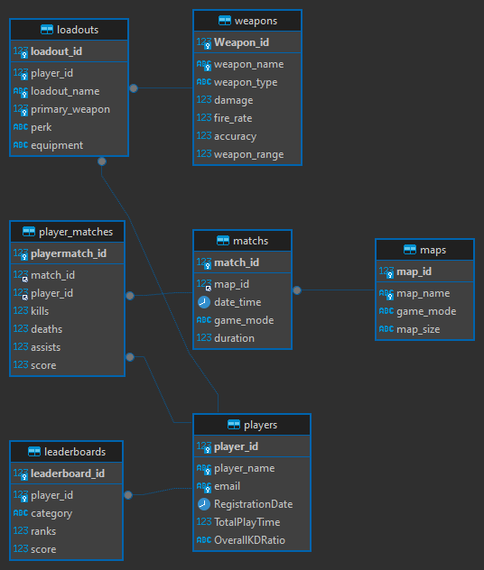

# Design Document - "Call of Duty Player Statistics and Game Management Database"

By Ala Saidi

## Scope

This database could track player performance, game statistics, and manage various aspects of the game:

- Player profiles: These contain essential information about each player,
- Weapon statistics: This tracks data for each weapon in the game
- Map data: This stores information about each map in the game
- Match history: This records details of each match played
- Leaderboards: These track player rankings across various categories
- Loadout configurations: This stores players' custom weapon and equipment setups

## Functional Requirements

This database will support:

- Create and manage player profiles
- Access weapon information
- View map information
- Record and retrieve match history
- Generate and view leaderboards
- Manage loadout configurations

### Entities and Relationships

## Representation

### Entities

- Players Table:

One-to-Many with Loadouts Table (One player can have many loadouts)

One-to-Many with Leaderboards Table (One player can have many leaderboard entries)

Many-to-Many with Matches Table (through PlayerMatches Table)

- Weapons Table:

Many-to-Many with Loadouts Table (A weapon can be in many loadouts, and a loadout can have multiple weapons)

- Maps Table:

One-to-Many with Matches Table (One map can host many matches)

- Matchs Table:

Many-to-One with Maps Table (Many matches can be played on one map)

Many-to-Many with Players Table (through PlayerMatches Table)

- Player_Matches Table:

Many-to-One with Players Table (Many player-match entries can be associated with one player)

Many-to-One with Matches Table (Many player-match entries can be associated with one match)

- Loadouts Table:

Many-to-One with Players Table (Many loadouts can belong to one player)

Many-to-One with Weapons Table for PrimaryWeaponID (Many loadouts can have the same primary weapon)

Many-to-One with Weapons Table for SecondaryWeaponID (Many loadouts can have the same secondary weapon)

- Leaderboards Table:

Many-to-One with Players Table (Many leaderboard entries can be associated with one player)

## Relationships

- Players participate in Matches (via PlayerMatches)
- Players create Loadouts
- Loadouts include Weapons
- Matches are played on Maps
- Players have entries in Leaderboards
